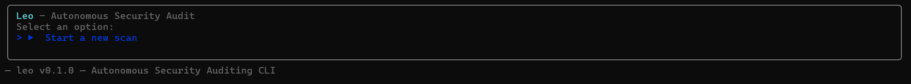
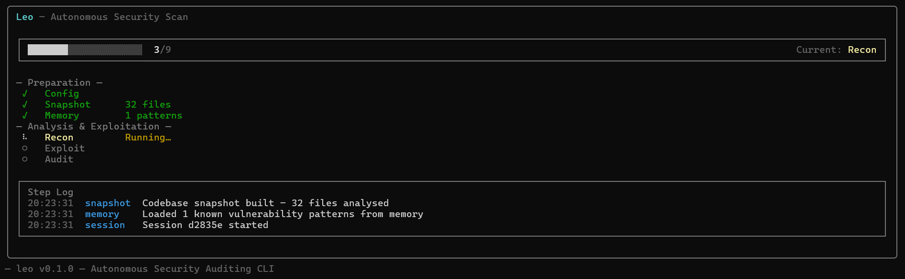

<p align="center">
[](https://www.npmjs.com/package/@leo-agent/cli)
[](https://www.npmjs.com/package/@leo-agent/cli)
[](LICENSE)
[](https://nodejs.org)
</p>

<h1 align="center">🦁 Leo</h1>
<p align="center"><strong>Autonomous Security Auditing CLI</strong></p>

<p align="center">
Leo is an AI-powered security auditor that scans your codebase for vulnerabilities,<br>
generates exploits, audits findings, applies patches, and learns from each session.
</p>

---
## Demo



---


> *Interactive dashboard showing live scan progress, phase tracking, and real-time logs.*

---

## Install

```bash
npm install -g @leo-agent/cli
```

Or run directly:

```bash
npx @leo-agent/cli
```

## Quick Start

```bash
# 1. Set up your API key
leo config

# 2. Launch the interactive TUI
leo

# 3. Or run a headless scan
leo scan
```

## What Leo Does

Leo uses a pipeline of LLM-powered agents to autonomously audit your code:

| Phase | Agent | What it does |
|-------|-------|-------------|
| 1 | **Snapshot** | Maps project structure, reads files |
| 2 | **Memory** | Loads known vulnerability patterns from DB |
| 3 | **Recon** | Identifies entry points, trust boundaries, secrets |
| 4 | **Exploit** | Generates attack scenarios |
| 5 | **Audit** | Cross-references findings against codebase |
| 6 | **Patch** | Creates and applies targeted patches |
| 7 | **Memory Update** | Persists new patterns for future scans |


## Commands

| Command | Description |
|---------|-------------|
| `leo` | Launch interactive TUI with session picker |
| `leo scan` | Run headless scan in current directory |
| `leo config` | Configure API key, model, scan depth |
| `leo history` | Show past session results |
| `leo status` | Show latest session summary |
| `leo restore [id]` | Restore files from a session's backups |
| `leo resume [id]` | Resume a previous session |
| `leo reset` | Clear all session data |

## Requirements

- **Node.js 20+**
- **OpenRouter API key** — get one free at [openrouter.ai](https://openrouter.ai)

## Architecture

```
                    ┌─────────────┐
                    │   Snapshot   │
                    └──────┬──────┘
                           ▼
                    ┌─────────────┐
                    │    Recon    │
                    └──────┬──────┘
                           ▼
              ┌────────────┴────────────┐
              ▼                         ▼
       ┌──────────┐             ┌──────────┐
       │ Exploit  │             │  Audit   │
       └────┬─────┘             └────┬─────┘
              └──────────┬──────────┘
                         ▼
                    ┌─────────────┐
                    │    Patch    │
                    └──────┬──────┘
                           ▼
                    ┌─────────────┐
                    │   Memory    │
                    └─────────────┘
```

Each agent sends structured prompts to an LLM via the OpenRouter API, receives JSON responses, and passes parsed data to the next stage. The Memory DB (SQLite) stores known vulnerability patterns across sessions.

## Configuration

Config is stored at `~/.leo/config.json`:

```json
{
  "openrouter_api_key": "sk-or-...",
  "default_model": "anthropic/claude-sonnet-4-5",
  "scan_depth": "deep",
  "created_at": "2026-06-22T14:00:00.000Z"
}
```

### Scan Depths

| Depth | Description |
|-------|-------------|
| `quick` | Light touch — entry points and obvious issues |
| `deep` | (Default) — Full pipeline with exploit generation |
| `paranoid` | Maximum coverage — aggressive pattern matching |

## Data Storage

Session artifacts are saved to `~/.leo/sessions/<project-hash>/`:

- `session.json` — metadata and scores
- `log.txt` — detailed step log
- `recon.json` — recon agent output
- `exploit.json` — exploit scenarios
- `audit.json` — audit findings
- `patches.json` — generated patches
- `memory_update.json` — memory agent output

Original files are backed up with a `.leo-backup` extension before patching.

## License

[Apache 2.0](LICENSE)
